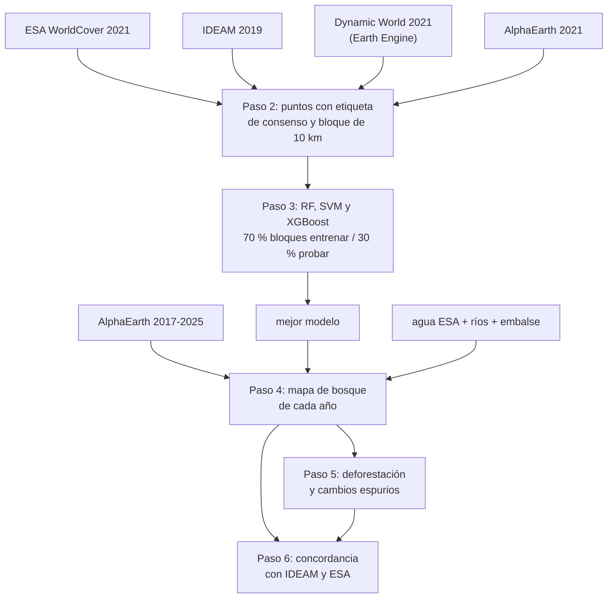
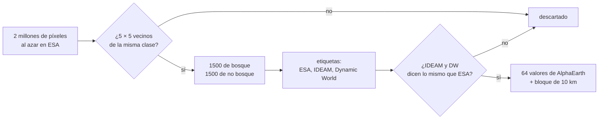
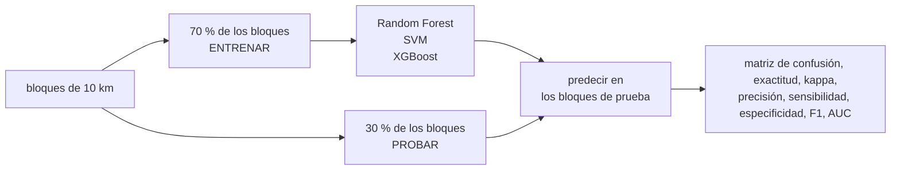
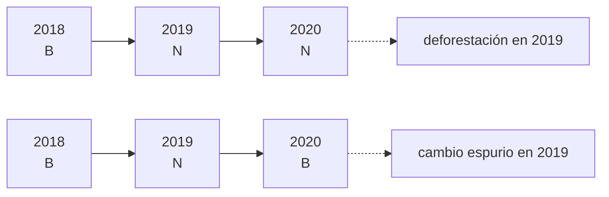

# Diagramas

## 1. Flujo completo

```mermaid
flowchart TD
    ESA["ESA WorldCover 2021"] --> P2
    IDEAM19["IDEAM 2019"] --> P2
    DW["Dynamic World 2021<br/>(Earth Engine)"] --> P2
    EMB21["AlphaEarth 2021"] --> P2
    P2["Paso 2: puntos con etiqueta<br/>de consenso y bloque de 10 km"] --> P3
    P3["Paso 3: RF, SVM y XGBoost<br/>70 % bloques entrenar / 30 % probar"] --> MOD["mejor modelo"]
    EMB["AlphaEarth 2017-2025"] --> P4
    MOD --> P4["Paso 4: mapa de bosque<br/>de cada año"]
    AGUA["agua ESA + ríos + embalse"] --> P4
    P4 --> P5["Paso 5: deforestación<br/>y cambios espurios"]
    P4 --> P6["Paso 6: concordancia<br/>con IDEAM y ESA"]
    P5 --> P6
```

## 2. Paso 2: puntos y etiquetas

```mermaid
flowchart LR
    A["2 millones de píxeles<br/>al azar en ESA"] --> B{"¿5 × 5 vecinos<br/>de la misma clase?"}
    B -- no --> X["descartado"]
    B -- sí --> C["1500 de bosque<br/>1500 de no bosque"]
    C --> D["etiquetas:<br/>ESA, IDEAM, Dynamic World"]
    D --> E{"¿IDEAM y DW<br/>dicen lo mismo que ESA?"}
    E -- no --> X
    E -- sí --> F["64 valores de AlphaEarth<br/>+ bloque de 10 km"]
```

## 3. Paso 3: entrenamiento y prueba por bloques

```mermaid
flowchart LR
    A["bloques de 10 km"] --> B["70 % de los bloques<br/>ENTRENAR"]
    A --> C["30 % de los bloques<br/>PROBAR"]
    B --> D["Random Forest<br/>SVM<br/>XGBoost"]
    D --> E["predecir en<br/>los bloques de prueba"]
    C --> E
    E --> F["matriz de confusión, exactitud, kappa,<br/>precisión, sensibilidad, especificidad, F1, AUC"]
```

## 4. Paso 5: deforestación o cambio espurio

B = bosque, N = no bosque.

```mermaid
flowchart LR
    a1["2018<br/>B"] --> a2["2019<br/>N"] --> a3["2020<br/>N"]
    a3 -.-> R1["deforestación en 2019"]
    b1["2018<br/>B"] --> b2["2019<br/>N"] --> b3["2020<br/>B"]
    b3 -.-> R2["cambio espurio en 2019"]
```
